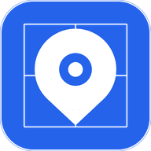

<div align="center">



# Map Atlas

**A modern, dependency-free web map engine and full-featured interactive atlas.**

No Leaflet. No Mapbox. No Google Maps. Just TypeScript, React, and pure engineering.

[](https://www.npmjs.com/package/map-atlas)
[](https://react.dev/)
[](https://www.typescriptlang.org/)
[](https://vite.dev/)
[](https://mapapp-lovat.vercel.app)
[](LICENSE)

[Live App (Vercel)](https://mapapp-lovat.vercel.app) · [Cloudflare Edge](https://map-atlas.apkscope.workers.dev) · [Interactive API Docs](https://mapapp-lovat.vercel.app/docs) · [npm](https://www.npmjs.com/package/map-atlas) · [Report Bug](https://github.com/jojin1709/map-atlas/issues)

</div>

---

## Highlights

- **Dependency-Free Map Engine** — Custom Web Mercator (EPSG:3857) engine handling raster tiles, retina scaling, inertia panning, pinch-to-zoom, SVG overlays, and popups with 0 heavy GIS libraries.
- **3D Globe Mode** — Seamless one-click switch to an interactive Three.js 3D earth globe with atmospheric glow, continuous rotation, country labels, and coordinates mapping.
- **Mobile First UX** — Persistent Google Maps-style top search pill, 5-tab thumb-friendly bottom navigation bar (`z-50`), device compass orientation, and auto-pan popups that never clip off-screen.
- **Live Overlays** — Real-time RainViewer weather radar precipitation overlay, live traffic flow, and real-time USGS seismic earthquake telemetry.
- **360° Street View** — Interactive street-level panorama modal directly from any map coordinate.
- **Turn-by-Turn GPS HUD** — Voice-guided navigation (Web Speech API), route countdown, dynamic re-routing connector, and elevation profiles.
- **Visual Offline Manager** — Estimate download size and cache high-res map tiles locally into IndexedDB / CacheStorage for zero-signal backcountry navigation.
- **Comprehensive API Docs** — Complete Leaflet-style API reference and embedding manual accessible directly in-app at `/docs`.

---

## Install

```bash
npm i map-atlas
# or
yarn add map-atlas
# or
pnpm add map-atlas
```

Peer dependencies:

```bash
npm install react react-dom
```

### CDN (no build step)

```html
<link rel="stylesheet" href="https://cdn.jsdelivr.net/npm/map-atlas@1.0.2/dist/styles.css" />
<script type="module">
  import { MapEngine } from 'https://cdn.jsdelivr.net/npm/map-atlas@1.0.2/dist/map-atlas.js'

  const map = new MapEngine('#map', {
    center: [51.5, -0.12],
    zoom: 13,
    tileUrls: ['https://tile.openstreetmap.org/{z}/{x}/{y}.png'],
  })

  map.addMarker({ lat: 51.5074, lng: -0.1278 }, { label: 'London' })
</script>
```

---

## Usage

### React — drop-in component

```tsx
import { MapAtlas } from 'map-atlas'
import 'map-atlas/styles.css'

export default function App() {
  return (
    <div style={{ height: '100vh', width: '100vw' }}>
      <MapAtlas
        center={[51.5, -0.12]}
        zoom={13}
        tileStyle="dark"
        markers={[
          { lat: 51.5074, lng: -0.1278, label: 'London' },
          { lat: 48.8566, lng: 2.3522, label: 'Paris' },
        ]}
        polylines={[
          {
            points: [
              { lat: 51.5074, lng: -0.1278 },
              { lat: 48.8566, lng: 2.3522 },
            ],
            color: '#1a73e8',
            weight: 4,
          },
        ]}
        onMapClick={(latlng) => console.log('Clicked:', latlng)}
      />
    </div>
  )
}
```

### React — all component props

```tsx
<MapAtlas
  center={[lat, lng]}              // [number, number] (latitude, longitude)
  zoom={12}                         // Initial zoom level (1-19)
  minZoom={1}                       // Lowest allowable zoom level
  maxZoom={19}                      // Highest allowable zoom level
  tileStyle="dark"                 // 'osm' | 'satellite' | 'dark' | 'topo' | 'humanitarian' | 'cyclosm'
  tileUrl="https://..."             // Custom tile URL template (e.g. {z}/{x}/{y}.png)
  attribution="..."                 // Custom attribution text/HTML
  markers={[]}                      // Array of MapAtlasMarker
  polylines={[]}                    // Array of MapAtlasPolyline
  polygons={[]}                     // Array of MapAtlasPolygon
  keyboard={true}                   // Enable arrow keys + +/- zoom controls
  inertia={true}                    // Enable momentum pan gliding
  scaleBar={true}                   // Show dynamic metric/imperial scale bar
  className="my-map"                // Optional wrapper CSS class
  cssStyle={{ borderRadius: 12 }}   // Optional inline styles
  onMapClick={(latlng, e) => {}}    // Map click callback
  onViewChange={(center, zoom) => {}} // Pan/zoom change callback
  onEngineReady={(engine) => {}}    // Access underlying MapEngine instance
/>
```

---

### Vanilla TypeScript / JavaScript

```ts
import { MapEngine, TILE_STYLES } from 'map-atlas'
import 'map-atlas/styles.css'

const engine = new MapEngine('#map-container', {
  center: [40.7128, -74.006],
  zoom: 12,
  tileUrls: TILE_STYLES.dark.tiles,
  attribution: TILE_STYLES.dark.attribution,
  keyboard: true,
  inertia: true,
  scaleBar: true,
})

// Event subscriptions
engine.on('click', ({ latlng }) => console.log('Clicked:', latlng))
engine.on('moveend', () => console.log(engine.getCenter(), engine.getZoom()))

// Adding Markers & Vectors
const marker = engine.addMarker({ lat: 40.7128, lng: -74.006 }, {
  label: 'NYC',
  color: '#e53935',
  size: 14,
})

const line = engine.addPolyline(
  [
    { lat: 40.7128, lng: -74.006 },
    { lat: 34.0522, lng: -118.2437 },
  ],
  { color: '#1a73e8', weight: 4, dash: '6 4' }
)

const poly = engine.addPolygon(
  [
    { lat: 40.8, lng: -74.1 },
    { lat: 40.8, lng: -73.9 },
    { lat: 40.6, lng: -73.9 },
    { lat: 40.6, lng: -74.1 },
  ],
  { fill: 'rgba(26,115,232,0.2)', color: '#1a73e8' }
)

// Viewport manipulation
engine.setView(51.5, -0.12, 14)
engine.flyTo(48.8566, 2.3522, 12, 800)
engine.fitBounds([
  { lat: 40.7, lng: -74.1 },
  { lat: 40.5, lng: -73.7 },
])

// Auto-panning Popups
const el = document.createElement('div')
el.textContent = 'Welcome to Map Atlas!'
engine.openPopup({ lat: 40.7128, lng: -74.006 }, el)

// Clean up
marker.remove()
line.remove()
engine.destroy()
```

---

### Built-in Tile Styles

```ts
import { TILE_STYLES } from 'map-atlas'

TILE_STYLES.osm          // OpenStreetMap Standard
TILE_STYLES.satellite    // High-res Esri World Imagery
TILE_STYLES.dark         // CARTO Dark Matter (High Contrast)
TILE_STYLES.topo         // OpenTopoMap (Contour lines & hillshades)
TILE_STYLES.humanitarian // Humanitarian OpenStreetMap (HOT)
TILE_STYLES.cyclosm      // CyclOSM (Bicycle infrastructure & elevation)

// Apply any preset:
engine.setTiles(TILE_STYLES.satellite.tiles, TILE_STYLES.satellite.attribution)

// Or specify any custom tile service:
engine.setTiles(['https://my-tiles.example.com/{z}/{x}/{y}.png'], '© My Custom Tiles')
```

---

### Geocoding & Search

```ts
import { geocode, reverse } from 'map-atlas'

// Forward geocoding with typo-tolerant fallback
const results = await geocode('Times Square')
// [{ label: 'Times Square, Manhattan, NY', lat: 40.758, lng: -73.9855, ... }]

// Reverse geocoding (coordinates to street address)
const address = await reverse(40.758, -73.9855)
// 'Times Square, Manhattan, New York, NY 10036, USA'
```

---

### Routing & Navigation

```ts
import { route } from 'map-atlas'

const routes = await route(
  'driving',  // 'driving' | 'walking' | 'cycling'
  [
    { lat: 40.7128, lng: -74.006 },
    { lat: 40.758, lng: -73.9855 },
  ]
)

const r = routes[0]
// r.distance  — Total distance in meters
// r.duration  — Total duration in seconds
// r.geometry  — GeoJSON coordinates [[lng, lat], ...]
// r.legs      — Turn-by-turn guidance steps
```

---

### Elevation & Weather

```ts
import { elevationBatch, weather } from 'map-atlas'

const elevations = await elevationBatch([
  { lat: 40.7128, lng: -74.006 },
  { lat: 40.758, lng: -73.9855 },
])
// [{ lat, lng, elevation }, ...]

const w = await weather(40.7128, -74.006)
// { temperature: 22, tempUnit: '°C', wind: 5.2, windUnit: 'km/h' }
```

---

### Geospatial Import & Export

```ts
import {
  parseGPX, toGPX,
  parseGeoJSON, toGeoJSON,
  parseKML, toKML,
  download,
} from 'map-atlas'

// Parsing uploaded tracks and shapes
const places = parseGPX(gpxXmlString)
const geoData = parseGeoJSON(geoJsonObject)
const { places: kmlPlaces, lines, polygons } = parseKML(kmlString)

// Exporting files
download('places.gpx', toGPX(places), 'application/gpx+xml')
download('places.geojson', JSON.stringify(toGeoJSON(places)), 'application/json')
download('places.kml', toKML(places), 'application/vnd.google-earth.kml+xml')
```

---

## API Reference

### `MapEngine`

| Method | Signature | Description |
|--------|-----------|-------------|
| `constructor` | `new MapEngine(container, opts?)` | Mount map on DOM element or selector |
| `on` | `on(event, handler)` | Subscribe to events (`click`, `mousemove`, `moveend`, `zoomend`, `zoomlimit-min`) |
| `off` | `off(event, handler)` | Unsubscribe from an event |
| `setTiles` | `setTiles(urls[], attribution?, cssFilter?)` | Swap raster base and overlay layers |
| `addMarker` | `addMarker(latlng, style?)` | Add marker pin & return `LayerHandle` |
| `addPolyline` | `addPolyline(latlngs[], style?)` | Add vector polyline & return `LayerHandle` |
| `addPolygon` | `addPolygon(latlngs[], style?)` | Add vector polygon & return `LayerHandle` |
| `addCircle` | `addCircle(latlng, style?)` | Add vector circle & return `LayerHandle` |
| `setClusterMarkers`| `setClusterMarkers(points[])` | Enable real-time dynamic marker clustering |
| `openPopup` | `openPopup(latlng, element)` | Open an auto-panning popup card at coordinates |
| `closePopup` | `closePopup()` | Close the active popup card |
| `getCenter` | `getCenter(): LatLng` | Get current map center coordinates |
| `getZoom` | `getZoom(): number` | Get current zoom level |
| `getBounds` | `getBounds(): LatLngBounds` | Get current bounding box viewport |
| `setView` | `setView(lat, lng, zoom?)` | Instantly jump to coordinate and zoom level |
| `flyTo` | `flyTo(lat, lng, zoom?, duration?)` | Smooth animated ease transition |
| `fitBounds` | `fitBounds(latlngs[], opts?)` | Fit camera view to enclose all coordinates |
| `zoomIn` | `zoomIn()` | Step zoom in (+1 level) |
| `zoomOut` | `zoomOut()` | Step zoom out (-1 level) |
| `destroy` | `destroy()` | Unbind listeners, animation frames, and unmount |

### `LayerHandle`

| Method | Description |
|--------|-------------|
| `remove()` | Remove layer from map canvas |
| `setLatLngs(latlngs[])` | Update polyline or polygon coordinate array |
| `setLatLng(latlng)` | Update marker or circle center coordinate |
| `setVisible(bool)` | Dynamically toggle layer visibility |

### `MapEngineOptions`

| Option | Type | Default | Description |
|--------|------|---------|-------------|
| `center` | `[lat, lng]` | `[0, 0]` | Initial center coordinates |
| `zoom` | `number` | `2` | Initial zoom level |
| `minZoom` | `number` | `1` | Minimum allowable zoom level |
| `maxZoom` | `number` | `19` | Maximum allowable zoom level |
| `tileUrls` | `string[]` | OpenStreetMap | Raster tile URL templates |
| `attribution` | `string` | OpenStreetMap | Attribution text or HTML |
| `keyboard` | `boolean` | `true` | Enable keyboard navigation (`Arrow keys`, `+`, `-`) |
| `inertia` | `boolean` | `true` | Momentum pan gliding physics |
| `scaleBar` | `boolean` | `true` | Render dynamic scale bar indicator |

---

## Complete Features

### 🗺 Custom Map Engine
- **Web Mercator Projection** — Industry-standard EPSG:3857 with sub-pixel rendering.
- **3D Globe Mode** — Interactive Three.js WebGL globe with atmospheric glow, auto-rotation, country boundaries, and instant 2D/3D toggle.
- **Inertia Panning & Pinch Zoom** — Native touch gesture tracking tuned for mobile and trackpads.
- **Marker Clustering** — Real-time clustering algorithm that aggregates points cleanly as zoom levels change.
- **Auto-Pan Popups** — Bounding box auto-pan ensures popup action cards ("Start here", "Destination", "Street View") never bleed off-screen.

### 🔍 Search & Turn-by-Turn Navigation
- **Typo-Tolerant Geocoding** — Photon + Nominatim fuzzy matching instantly resolves misspelled searches.
- **Turn-by-Turn GPS HUD** — Full-screen navigation with distance countdown, voice announcements (`SpeechSynthesis`), turn preview cards, and route overview.
- **Route Guidance Connector** — Dynamic indicator connecting off-route user locations directly to the route start.
- **Multi-Stop Route Planning** — Add, reorder, and clear waypoints with shortest-distance route optimization.
- **Elevation Profiles** — Dynamic SVG elevation chart along route geometry.

### 🛠 Visual Tools & Overlays
- **Live Weather Radar Overlay** — Real-time RainViewer precipitation radar layer with dynamic frame tracking.
- **Live Traffic Flow** — Real-time traffic congestion and speed overlay.
- **360° Street View** — Panoramic viewer modal with multi-provider fallback.
- **Live Earthquakes** — USGS seismic magnitude feed with pulsating intensity markers.
- **Distance & Area Measurement** — Click points to measure multi-segment distances and polygon areas.
- **Drawing Tools** — Draw lines, polygons, and rectangles with full Undo/Redo (`Ctrl+Z` / `Ctrl+Y`).
- **Device Compass Sensor** — Real-time heading orientation using device sensor gyroscope APIs.

### 💾 Offline Storage & Mobile PWA
- **Visual Offline Area Manager** — Select an area radius, preview estimated download size, and batch cache tiles locally into IndexedDB.
- **Persistent Mobile UI** — Top search pill and 5-tab bottom navigation (`z-50`) locked in place; never hide or shift unexpectedly.
- **Progressive Web App (PWA)** — Installable on Android, iOS Safari, and Desktop Chrome with offline service worker support.
- **Import & Export** — Full roundtrip support for GPX, GeoJSON, and KML files.

---

## Embed Mode

Embed a map into any iframe with URL parameters — no code required:

```html
<iframe
  src="https://mapapp-lovat.vercel.app/?embed=true&lat=48.8584&lng=2.2945&zoom=16&style=dark"
  width="100%"
  height="500"
  frameborder="0"
></iframe>
```

| Param | Description | Example |
|-------|-------------|---------|
| `embed=true` | Hides side panel, fullscreen map only | `?embed=true` |
| `lat`, `lng` | Initial center coordinate | `lat=48.8584&lng=2.2945` |
| `zoom` | Initial zoom level | `zoom=16` |
| `style` | Tile style preset | `style=satellite` |
| `marker` | Pin location and label | `marker=48.8584,2.2945,Eiffel+Tower` |

---

## Keyboard Shortcuts

| Key | Action |
|-----|--------|
| `↑` `↓` `←` `→` | Pan map |
| `+` / `=` | Zoom in |
| `-` | Zoom out |
| Double-click | Zoom in at cursor |
| Scroll wheel | Zoom at cursor |
| Pinch | Native touch pinch-to-zoom |
| Right-click / Long-press | Context menu (set start/dest, street view, copy coords) |

---

## Architecture

```
src/
├── index.ts                 # Public npm library entry point
├── engine/                  # Dependency-free map engine (TypeScript)
│   ├── MapEngine.ts         # Pan, zoom, overlays, popups, clustering, scale
│   ├── GlobeEngine.ts       # Three.js 3D earth globe with atmosphere
│   ├── projection.ts        # Web Mercator mathematical projections
│   └── tiles.ts             # Tile layer pipeline with retina support
├── services/
│   ├── api.ts               # Geocoding, routing, RainViewer radar, USGS earthquakes
│   ├── geo.ts               # Haversine, distance/area formatting, GPX/GeoJSON/KML
│   ├── offline.ts           # IndexedDB offline tile cache storage manager
│   └── mapRef.ts            # Global engine reference bridge
├── store/
│   └── useAppStore.ts       # Zustand reactive application state
├── components/
│   ├── MapAtlas.tsx         # Drop-in React component library export
│   ├── MapView.tsx          # Map container, floating dock, and globe toggle
│   ├── Layout.tsx           # Side panel, mobile search bar, and bottom navigation
│   ├── SearchPanel.tsx      # Autocomplete search, category chips, recent history
│   ├── DirectionsPanel.tsx  # Multi-stop routing, profile switcher, elevation
│   ├── LayersPanel.tsx      # Map styles, weather radar, traffic, 3D globe toggle
│   ├── ToolsPanel.tsx       # Measurement, drawing tools, heatmap, offline manager
│   ├── PlacesPanel.tsx      # Saved bookmarks, GPX/GeoJSON/KML import and export
│   ├── DocsView.tsx         # Complete interactive Leaflet & Atlas API documentation
│   ├── StreetViewModal.tsx  # 360° panoramic street-level viewer modal
│   ├── OfflineManagerModal.tsx # Visual offline area tile downloader
│   └── NavOverlay.tsx       # Turn-by-turn navigation HUD with voice guidance
├── types/                   # Shared TypeScript definitions
├── config.ts                # App configuration and service endpoints
├── App.tsx                  # Root application router (/ and /docs)
└── index.css                # Tailwind CSS + custom design system tokens
```

---

## Contributing

Contributions are welcome! Please feel free to open an issue or submit a pull request:

1. Fork the repository
2. Create your feature branch (`git checkout -b feature/amazing-feature`)
3. Commit your changes (`git commit -m 'feat: add amazing feature'`)
4. Push to the branch (`git push origin feature/amazing-feature`)
5. Open a Pull Request

---

## License

MIT License — see [LICENSE](LICENSE) for details.

## Credits & Attributions

- Map data © [OpenStreetMap](https://www.openstreetmap.org/copyright) contributors ([ODbL](https://opendatacommons.org/licenses/odbl/))
- Satellite imagery © [Esri](https://www.esri.com)
- Dark matter tiles © [CARTO](https://carto.com)
- Topographic contours © [OpenTopoMap](https://opentopomap.org) (CC-BY-SA)
- Weather radar data © [RainViewer](https://www.rainviewer.com/api.html)
- Weather data © [Open-Meteo](https://open-meteo.com/)
- Seismic data © [USGS Earthquake Hazards Program](https://earthquake.usgs.gov/)

---

<div align="center">

**Built with ❤️ by [Jojin John](https://github.com/jojin1709)**

⭐ Star this repository if you find it helpful!

</div>
